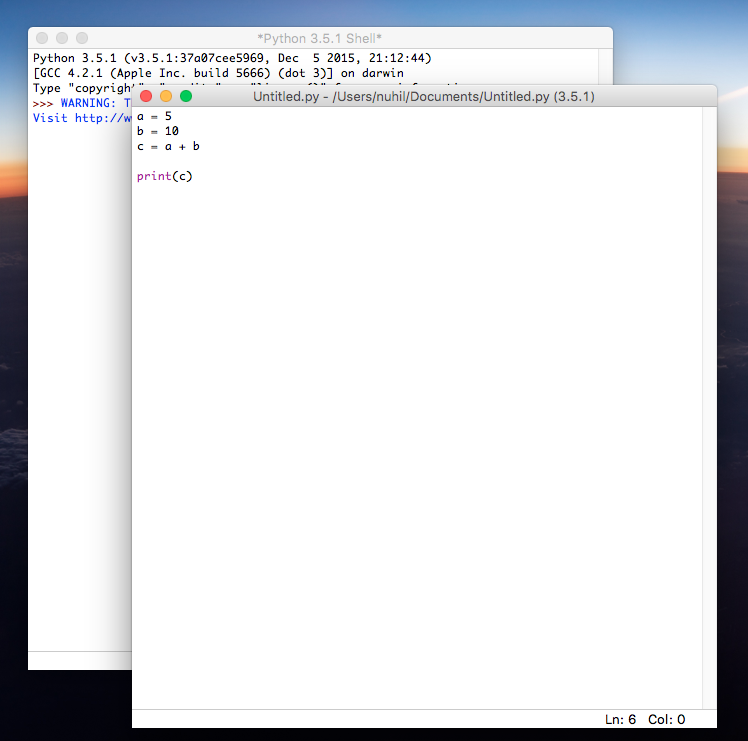
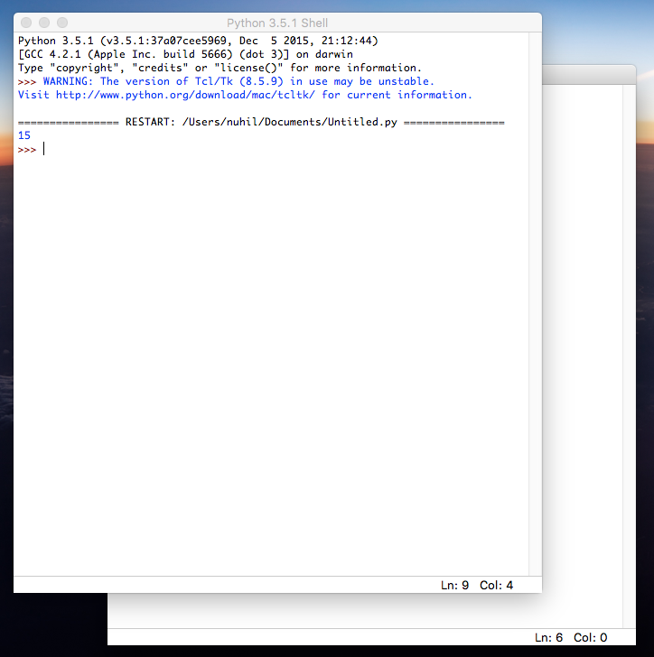

## এডিটর এর ব্যবহার   

এখন পর্যন্ত আমরা পাইথনের কনসোলে স্টেটমেন্ট লিখে তা পাইথনের ইন্টারপ্রেটারের মাধ্যমে এক্সিকিউট করে আউটপুট দেখেছি। এই পদ্ধতির অসুবিধা হচ্ছে প্রতিবার একটি করে লাইন লেখা যায় এবং এক্সিকিউট করা যায়। কিন্তু বাস্তব একটি প্রোগ্রাম লেখার সময় সেটি অনেক লাইন তথা ফাংশন, কন্ট্রোল, লজিক মিলে হতে পারে। এ জন্য পাইথন প্রোগ্রামকে একটি ফাইলে লিখে সেই ফাইলকে `.py` এক্সটেনশনে সেইভ করে পরবর্তীতে একই পাইথন ইন্টারপ্রেটারের মাধ্যমে রান করানো যায়। এর জন্য দরকার ভালো একটি এডিটর বা আইডিই।     

**IDLE**  
আগেই বলা হয়েছে, পাইথনের অফিসিয়াল ইন্সটলেশনের সাথে একটি গ্রাফিক্যাল টুল IDLE ইন্সটল হয়। এটির মাধ্যমেও পাইথন সোর্স কোড ওয়ালা ফাইলকে রান করানো যায়। এর জন্য যা করতে হবে,  

- IDLE প্রোগ্রামটি চালু করতে হবে
- File মেনু থেকে New File সিলেক্ট করে নতুন ফাইলে পাইথন কোড/প্রোগ্রাম লিখতে হবে

   

- ফাইলটি সেইভ করতে হবে 
- Run মেনু থেকে Run Module ক্লিক করতে হবে তাহলে নিচের মত আউটপুট স্ক্রিন তৈরি হবে

   

**IDE**   
পাইথনের অফিসিয়াল IDLE ব্যবহার করা ছাড়াও অনেক পপুলার এবং ইনটেলিজেন্ট IDE তথা Integrated Development Environment আছে। তার মধ্যে উল্লেখযোগ্য হচ্ছে PyCharm. এতে কোড লেখা, ডিবাগ করা, টেস্ট করা, প্যাকেজ ম্যানেজ করা, প্রজেক্ট স্পেসিফিক ইন্টারপ্রেটার সিলেক্ট করে দেয়া, ভার্চুয়াল এনভায়রনমেন্ট তৈরি করা ছাড়াও বড় বড় পাইথন প্রজেক্ট খুব সহজে হ্যান্ডেল করা যায়। PyCharm এর ফ্রি এডিশন (Community Edition) ডাউনলোড করা যাবে [এখান থেকে](https://www.jetbrains.com/pycharm/download/)।  

এরকম IDE এর ব্যবহার জানতে গুগল অথবা অভিজ্ঞদের সাহায্য নেয়া যেতে পারে অথবা PyCharm এর সাইটেই [ব্যাসিক ইউসেজ](https://www.jetbrains.com/pycharm/documentation/) দেয়া আছে। 
